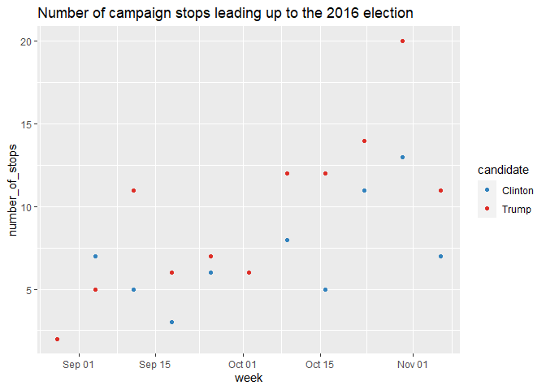
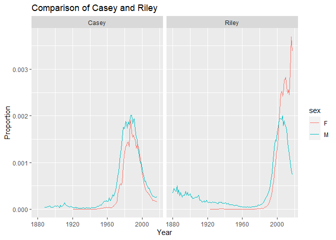

R Code from Data Science Projects
================

## Data visualizations for SDS 192

This is a document containing two data visualizations I created for my
data science class!

## Number of campaign stops Clinton and Trump made each week leading up to the 2016 election.

Code and Visualization:

``` r
library(ggplot2)
library(dplyr)
library(fivethirtyeight)
library(moderndive)
library(lubridate)
```

  

``` r
weekly_campaign_stops <- pres_2016_trail %>% 
  mutate(week = floor_date(date, unit = "week")) %>% 
  group_by(candidate, week) %>% 
  summarize(number_of_stops = n())

ggplot(data = weekly_campaign_stops, mapping = aes(x = week, y = number_of_stops, color = candidate)) +
  ggtitle("Number of campaign stops leading up to the 2016 election")+
  geom_point()+
  scale_color_manual(breaks = c("Clinton", "Trump"),
                        values=c("#3182bd", "#de2d26"))
```

<!-- -->

## Extent to which the names “Casey” and “Riley” were used for babies of both sex male and female.

Code and Visualization:

``` r

library(babynames)

babynames_riley_casey <- babynames %>% 
  filter(name == "Riley"|name == "Casey")

ggplot(data = babynames_riley_casey, aes(x=year,y=prop, summary = sex, color=sex))+
  ggtitle('Comparison of Casey and Riley')+
  geom_line()+
  facet_wrap(~name)+ 
  labs(x = "Year", y = "Proportion")
```

<!-- -->

\`\`\`
